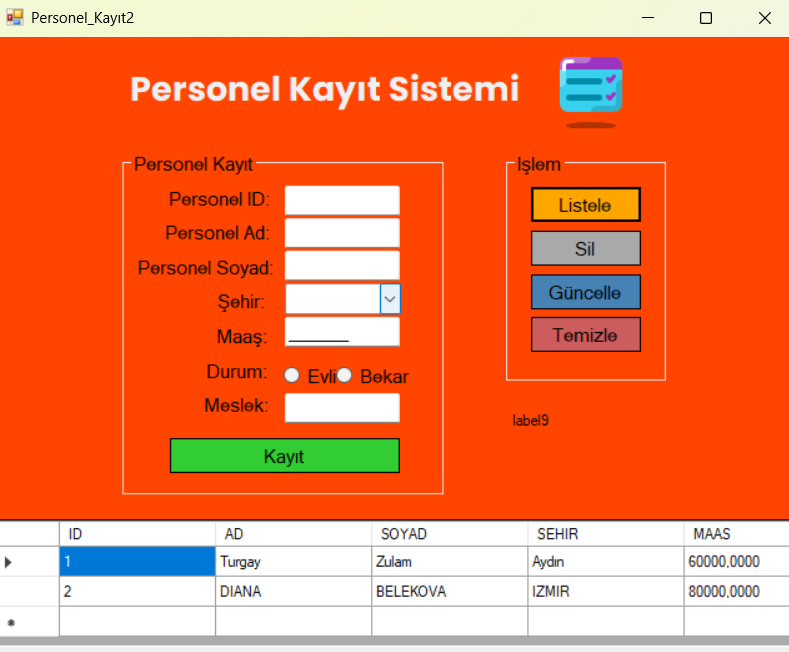
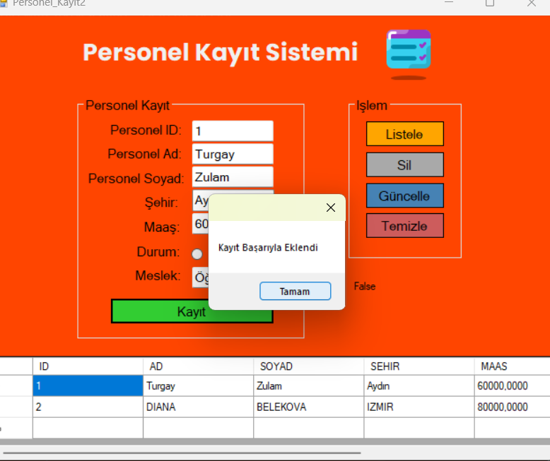

## Okulda Yaptığımız İlk Veritabanı Bağlantılı Windows Form Projesi

### 📋 Listeleme İşlemi
"Listele" butonuna tıkladığımızda, veritabanındaki kayıtlar ekranda listelenir.

### ➕ Kayıt Ekleme
"Kayıt" butonuna tıklandığında, formda girilen veriler veritabanına kaydedilir.

### 🔄 Güncelleme İşlemi
Listelenen verilerden birine çift tıklayarak, o veriyi form alanlarına aktarabiliriz. Güncelleme işlemi yapıldıktan sonra "Güncelle" butonuyla veritabanında ilgili kayıt güncellenir.

### ❌ Silme İşlemi
Silmek istediğimiz kaydı listeden çift tıklayarak seçiyoruz. Ardından "Sil" butonuna tıklayarak kayıt siliniyor.

### 🧹 Temizleme
"Temizle" butonuyla form üzerindeki tüm alanlar temizlenir.

### ✅ İşlem Sonu Bildirim
Her işlem sonrası kullanıcıya, işlemin başarılı olup olmadığını gösteren bir `MessageBox` ile bilgi verilir.

